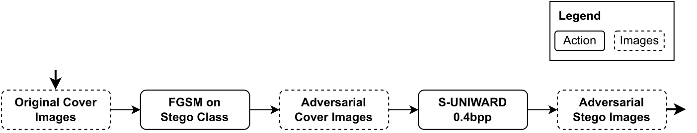
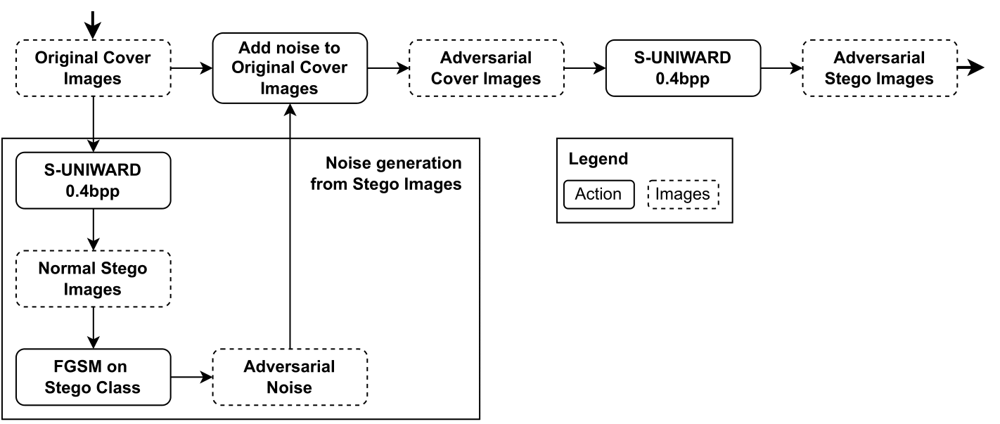

# Adversarial attacks to SRNet

According to what is mentioned in the different papers related to Deep Learning steganalysis, the performance of the presented models is able to reach up to 90% accuracy on benchmark datasets such as [BOSS](http://agents.fel.cvut.cz/boss/) and [BOWS](http://bows2.ec-lille.fr/). This repository shows code to perform both a black box attack based on the use of a more variable dataset such as ImageNet and two white box attacks based on [Fast Gradient Signed Method](https://www.tensorflow.org/tutorials/generative/adversarial_fgsm). The ultimate goal of using these attacks is to test if [SRNet](https://ieeexplore.ieee.org/document/8470101) is able to obtain similar results with much more complex datasets that could be used by a potential attacker who wants to remain undetected.

The model that is used to make the adversarial attacks is the one available in the [SRNet-Tensorflow-Implementation](https://github.com/davidggz/SRNet-Tensorflow-Implementation) repository.

## Black-box attack

The proposed black box attack only involves the use of a much more variable dataset such as [ImageNet](https://www.image-net.org/). Specifically, the dataset used is [ImageNet Mini](https://www.kaggle.com/datasets/ifigotin/imagenetmini-1000) which is available in Kaggle. To preprocess this dataset, the notebook `black_box_attack/prepare_imagenet_mini.ipynb` was used. It is recommended the use of the steganographic algorithm implementations that can be found on the [Binghamton University website](http://dde.binghamton.edu/download/stego_algorithms/) to generate the stego images.

## White-box attack

A white box attack is one in which the model to be attacked is fully accessible. Fast Gradient Signed Method is an algorithm that performs a white box attack on any Deep Learning model that consists of obtaining the gradient with respect to the different images with the aim of changing its pixels slightly so that it is misclassified by the model. More information about the algorithm can be seen in [Ian Goodfellow et al.](https://arxiv.org/abs/1412.6572).

As mentioned above, the pixels of the input images are modified in order to be misclassified by the model. This makes FGSM not directly applicable in the field of Steganalysis because if the pixels of the images were changed, the hidden message would be lost. That is why two different approaches are proposed that are able to change only those pixels that do not contain a hidden message.

### fromCover

  

This algorithm only takes the cover images (without hidden message) and applies FGSM on the stego class. That is, our goal is that the cover images we introduce in FGSM are as far away as possible from the stego class present in the model. Then, the hidden message is introduced.

### fromStego

  

This algorithm is very similar to the previous one, but the adversarial perturbations to be added to the images are obtained from those same images with the hidden message. Finally, the initial cover images are taken and the perturbations obtained from the stego images are added to them.

## Impact reduction

To reduce the impact produced by these two algorithms, retraining, fine tuning and regularisation were tested. In particular, the regularisation used is the one presented in [Ian Goodfellow et al.](https://arxiv.org/abs/1412.6572) and its implementation can be found in `steganalysis-adversarial-attacks/white_box_attack/FGSM_regularization/`. This regularisation did not give very good results as it is based on the fact that changing the image pixels does not have an impact on the image labels. However, as mentioned above, in the field of stegoanalysis it does have an impact)

## Author
David González González <a href="https://www.linkedin.com/in/david-gonzalez-gonzalez/">LinkedIn</a>
